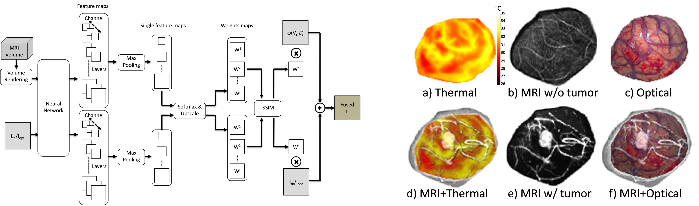

# 3D-2D Medical Image Fusion
This is the open source toolkit for the EMBC 2019 single page paper titled [Multimodal  Medical  Image  Fusion  by  optimizing  learned  pixel  weights using  Structural  Similarity  index](https://tu-dresden.de/ing/informatik/smt/cgv/ressourcen/dateien/publikationen/2019/Kumar-2019-EMBC.pdf?lang=en) by **N.Kumar et al**. This repository will provide insights into performing 3D-2D medical image fusion (especially for 3D MRI and 2D thermal and optical images) which would help clinical professionals in making finer diagnostic decisions during image guided neurosurgery. In this repository, we show how to extract tumor information from 3D MRI volume and fuse it with 2D intraoperative thermal and optical images with a good level of precision. 

**Note:** Please cite the paper if you are using this code in your research. The citation should be done as follows:

``` Kumar, N., Hoffmann, N., Oelschlägel, M., Koch, E., Kirsch, M., & Gumhold, S. Multimodal Medical Image Fusion by optimizing learned pixel weights using Structural Similarity index.```

# Prerequisites
* Python 2.7
* Pytorch 1.0 and above
* 3D Slicer
* numpy
* matplotlib

## Results



# Usage
The steps that needs to be executed to conduct 3D-2D Medical Image Fusion are mentioned below. Please be aware that fusion itself is a real time process due to the usage of pre-trained VGG-19 parameters but the complete workflow itself is non real-time.

1. Obtain a 3D brain MRI volume preferably in ``` .nii``` format. In case you have other volumetric formats such as ``` .nifti```, then it is recommended to convert it into ``` .nii``` format. Additionally, please ensure there are enough intraoperative points on the cortical surface. 

2. Now, calculate the normal vector based on the intraoperative points using the code snippet given in ``` crop_volume.py```. 

3. Open the 3D brain MRI volume in the **Crop Volume** module of 3D Slicer and extract the cropped MRI volume based on intraoperative points at the cortical surface slice with origin O1 and corresponding intraoperative points at bottom slice with certain depth 'd' and origin O2. This is a manual step and requires good hands on experience with 3D Slicer.

4. Now, extract the 2D MRI slice of the cortical surface by running ```data_volume_slicing.py``` and save it as h5py file. You can also extract the 2D MRI tumor label slice by running ```data_label_slicing.py``` and save as h5py file. However, only the extracted 2D MRI slice will be required in the subsequent steps.

5. Now, fix the intrinsic parameters of the thermal/optical camera obtained from calibration results using the code snippet given in ```fix_intrinsic_param.py```. **Note:** The parameter values given in ```fix_intrinsic_param.py``` are the values for the thermal/optical cameras used in the local clinical setup by default. Please change these values based on your own intrinsic camera parameters. 

6. Fix the extrinsic parameters of the thermal/optical camera by performing landmark registration of these 2D images with already extracted 2D MRI image of cortical surface using **LandmarkRegistration** module of 3D slicer.  This is also a manual step and requires good hands on experience with landmark registration tool 3D Slicer. It is highly possible that the manual registration might lead to decrease in registration accuracy. 

7. Finally, run the ```3D_2D_Medical_Image_Fusion.ipynb``` to perform the real time fusion of manually registered and rendered 2D MRI slice with 2D Thermal and optical images. In this notebook, we feed the rendered MRI slices and other images into some pre-trained VGG-19 network layers and select the best weight map by maximising Structural Similarity index (SSIM) of the fused image. 
